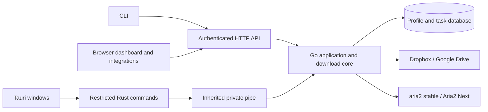

# TrueDown core, clients and native desktop

Reviewed: 2026-09-08. The Go core, HTTP CLI, private desktop transport, native
windows, versioned profile migration, recoverable native bundle updates and
release packaging are implemented. The legacy Go desktop entry point is retired.

## Ownership

`internal/app.Run(context.Context, Options)` composes the service. The core owns
the profile lock, SQLite, authentication, typed configuration, resolver modules,
queue and engine recovery. `cmd/truedown-core` runs the console service;
`cmd/truedown` is an HTTP-only client, named `truedown-cli.exe` on Windows.
`TrueDown` is the Tauri desktop executable. `truedown-core [serve]` runs the
independent service; `TrueDown --background` starts the desktop without showing
its main window. The Go core never opens a browser, creates a tray, or registers
an OS login entry. Its startup HTTP endpoint reports that desktop capability as
unavailable; native settings route the operation to Rust.

`desktop/` owns native windows, tray, clipboard and login startup. It packages
the Go executables as [Tauri sidecars](https://v2.tauri.app/develop/sidecar/).
The CLI resolves the profile for Rust, so platform defaults and migration rules
have one implementation. Profile identity scopes the native single instance and
login registration. The core's own lock remains authoritative across all clients.

Bundled windows use bounded, correlated JSON frames over inherited stdio.
`internal/protocol/routes.json` defines the exact method/path allowlist for both
Go and Rust; arbitrary URLs, commands and paths never cross that adapter. HTTP
host, origin and token checks remain in place for browser integrations. Tokens
stay out of native JavaScript; copying an API Key uses the system clipboard.

When the shell owns the core, closing its pipe cancels the service and engine.
When an existing service owns the profile, the Go bridge verifies its product,
protocol and profile identity, then attaches through authenticated loopback HTTP.
Exiting that desktop detaches without terminating the independent service.
Protocol version 1 is checked by both desktop and CLI. Unexpected disconnects
allow at most three core restarts, resetting after two healthy minutes. Requests
are never replayed automatically. An intentional HTTP/CLI exit closes the shell;
an attached bridge reconnects with an attach-only flag and cannot start a new
independent service. Windows console cores join a kill-on-close job before any
engine starts; aria2 also watches its owner's PID on every platform. The native
release identity binds the shell, local CLI and every owned core connection.

## UI and preferences

The main window contains downloads. Settings, application logs and about each
reuse one separate native window. Closing a window hides it while the core keeps
running; settings category, scroll position and unsaved controls survive reopen.
Ctrl/Cmd+, opens settings; Ctrl/Cmd+S saves the active settings category.
Auxiliary commands are restricted by window role.

The browser and native frontend share `api.js`, `task-view.js`, `settings.js`,
`logs.js`, `workspace.js`, and the canonical component runtime. Task rows are
reconciled by identity, hidden task views stop polling, and late responses must
match the current route/query. Settings have an overview and typed categories.
Working surfaces stay readable with Windows Fluent and macOS system styling;
Mica/vibrancy respects transparency/contrast preferences and has solid fallbacks.
Windows tray icons choose the exact raster for the taskbar monitor's DPI.
The macOS status item uses a 64px source for its 18pt Retina rendering. Window
sizes and minimums fit the monitor's work area, including native frame metrics,
and are recalculated when moving between display scale factors.

All durable task defaults use `GET/POST /settings/task-defaults`: a strict 64 KiB
schema, revision preconditions, and atomic persistence. Stale writes return 409;
failed saves retain the user's draft. Legacy localStorage is imported only at
revision zero and removed after successful persistence. CLI additions explicitly
opt into these shared defaults. Existing integration request parameters retain
their behavior. Headers/proxies never appear in task snapshots.

The CLI supports status, add, paginated list, pause, resume, retry, exit and local
`paths`; `--json` supports scripts. Exit codes are 0 success, 1 connection/API
failure, 2 invalid arguments and 3 partial task operation failure. It checks
`GET /system/info` before network commands, bounds payloads, rejects redirects,
and requires HTTPS and authentication for remote endpoints.

## Profile storage

Program files and mutable data have separate lifecycles. A single profile groups
configuration, task records, recovery state, logs and regenerable cache through
typed paths. Separate JSON files reflect distinct schemas and transaction owners;
the UI does not expose a separate path setting for every file.

| Role | Windows | macOS | Linux |
| --- | --- | --- | --- |
| Configuration and local secrets | LocalAppData/TrueDown/config | Application Support/TrueDown/config | XDG_CONFIG_HOME/truedown |
| Database, module packages, installed engines | LocalAppData/TrueDown/data | Application Support/TrueDown/data | XDG_DATA_HOME/truedown/data |
| Restart/BT/update state | LocalAppData/TrueDown/state | Application Support/TrueDown/state | XDG_STATE_HOME/truedown |
| Logs | LocalAppData/TrueDown/logs | Library/Logs/TrueDown | XDG_STATE_HOME/truedown/logs |
| Cache | LocalAppData/TrueDown/cache | Library/Caches/TrueDown | XDG_CACHE_HOME/truedown |
| Downloaded files | Existing user-selected directory | Existing user-selected directory | Existing user-selected directory |

Windows resolves LocalAppData through its Known Folder API, honoring redirection.
Linux ignores relative XDG values and defaults to `~/.config`, `~/.local/share`,
`~/.local/state`, and `~/.cache`. macOS Application Support is under `~/Library`.
The layout follows [Windows Known Folders](https://learn.microsoft.com/en-us/windows/win32/shell/knownfolderid),
[Apple directory guidance](https://developer.apple.com/library/archive/documentation/FileManagement/Conceptual/FileSystemProgrammingGuide/MacOSXDirectories/MacOSXDirectories.html),
and the [XDG specification](https://specifications.freedesktop.org/basedir/latest/).

`--data-dir` takes precedence over `TRUEDOWN_DATA_DIR`. Explicit/environment roots
and recognized legacy Windows profiles group all roles beneath that root, keeping
portable installations portable. Existing profiles beside a Windows executable
remain selected; discovery does not scan disks or merge databases. `truedown.profile.json`
version 1 pins the role paths so later environment changes cannot silently move
half a profile. The root anchors the process lock and migration metadata. Default
downloads stay at the original root's `downloads`; existing task output paths are
never rewritten. `truedown-cli paths` and settings display the actual role paths.

Migration runs under the profile lock before log writers, database stores or
engines start. It records a bounded journal, checkpoints SQLite WAL, checks the
database, copies only recognized files/directories, and verifies SHA-256. It
refuses symlinks, nonregular files, conflicting destinations and uncheckpointed
WAL. The synchronized atomic layout write is the commit point. Only then are old
files archived beneath `profile-backup-v0`; interrupted archiving resumes from
the manifest. Before commit the old layout stays authoritative; retry replaces
only journal-owned destination copies. Downloads are never copied or deleted.
The retained archive is a migration snapshot, not an automatic downgrade path:
tasks created after migration live in the new database.

WebView caches are created after the core commits migration. Windows and Linux
windows share the same profile cache, limiting browser processes and isolating profiles.
The native builder receives the absolute cache path directly; Tauri's JSON
configuration only accepts relative cache paths. Cache contains no authoritative
download settings, tokens or resumable BitTorrent state.
WKWebView uses a stable profile-specific website store on macOS 14 and newer.
Older systems use ephemeral website data because WKWebView cannot select a
persistent store there. Authoritative preferences still persist in the Go core.

## Startup and releases

Login startup is opt-in and profile-scoped. Native Windows uses a quoted HKCU Run
entry and reports when Windows has disabled it. Linux uses an XDG autostart entry;
macOS uses a LaunchAgent. The OS registration is authoritative and contains no
credentials. Unsupported process-scoped overrides report their limitation in
settings. An in-place Windows upgrade migrates a recognized legacy Go command
for the exact same executable and profile to the native background command. The
existing value name and Windows disabled state remain intact. Registrations for
other executable locations or profiles are never overwritten.

Standalone services leave program updates to their package owner. Numbered
Windows native packages use manifest schema 2, binding archive SHA-256, platform,
protocol, and the sizes/hashes of shell, core, CLI and both notice files. The
release schema prevents legacy single-executable updaters from installing an
incomplete native package; the first migration requires the complete new package.
The native core retires old single-executable pending metadata while preserving
update preferences and installed engines. No legacy executable apply helper is
shipped. A standalone Windows core relaunch leaves its old process job and
establishes a new one before starting aria2.

An installation-scoped helper prepares synchronized candidates and `.previous`
backups for every application file. It replaces each target without removing the
launch entry point first, checks the new native window and owned core, and rolls
back the complete file set on failure. A persisted installation marker delegates
interrupted updates to a verified copied helper before any CLI/profile startup.
Recovery is repeatable after a partially completed replacement or rollback. The
new core finalizes pending state under its profile lock; the helper never rewrites
settings after the healthy core begins serving requests. Updates restart hidden.
Downloaded files, SQLite, configuration, bundled aria2 and NEXT stay outside the
program replacement set. Native release scripts package all three components and
their notices. The Windows archive manifest is schema 2; Linux retains its
architecture-specific tarball and macOS uses Tauri's standard application bundle.
Release publication depends on all five packages plus native UI/recovery tests.
Each package must complete frontend startup using its own matching CLI
and core before archiving. The aggregate validator checks all executable
architectures, Unix permissions, native notices and Windows component hashes.
macOS builds verify their signature and use Tauri's signing/notarization
credentials when configured; the credential-free default is ad-hoc signing.
Windows package acceptance uses background startup. Linux maps its view inside
Xvfb because WebKitGTK can defer loading an unmapped view; this never opens a
window on the user's desktop.

## Validation

Go tests and vet, Node regressions and component synchronization pass. Windows
and Linux/WSL tests exercise profile defaults, pinned paths, failed-copy retry,
interrupted archive completion, real SQLite WAL checkpointing, preserved paused
and completed task records, and unchanged partial download files. Linux service
smoke covers download, single instance, SQLite and clean engine shutdown.

Private-pipe tests cover owned/attached service lifetimes, authentication and EOF.
Hidden Windows WebView2 acceptance covers all four native windows, shared cache,
settings saves and drafts, credentials, role restrictions, contrast fallback,
125%/200%/300% layouts, forced core recovery, engine cleanup and external exit.
Exact tray raster tests cover 100% through 400%
scaling. No interactive acceptance windows or login/logout cycle are used.
Hidden Linux WebKitGTK acceptance under Xvfb covers the four native windows,
settings persistence and bounded layouts. The native CI matrix builds and tests
Windows, Linux and macOS, with platform WebView acceptance on Windows and Linux.
Hidden Windows native package acceptance covers successful upgrade, failed
window/build health rollback, and recovery after partial component replacement.
Every path verifies all application hashes and preserves the engine. macOS
packaged WKWebView startup and signature checks are enforced in the release
matrix; they have not been run locally because this workspace has no macOS runtime.

An earlier local Chromium benchmark of 100 changing rows over 30 iterations
measured median render plus layout dropping from 54 ms to 5.2 ms after row
reconciliation. This measures that rendering path, not whole-application latency
or download throughput. Tauri retains the same frontend, so its process change
alone is not treated as proof of UI performance improvement.
