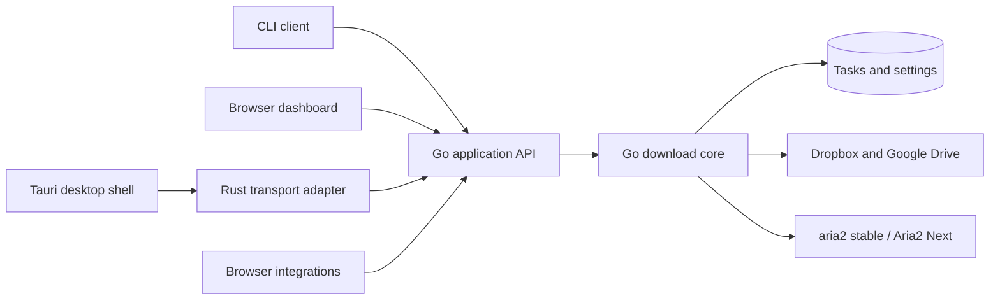

# TrueDown core, CLI, and desktop architecture

Reviewed: 2026-09-08. This document distinguishes the implemented foundation from
the proposed Tauri migration. Tauri has not been added to this repository.

## Direction

Retain the Go download core and expose it through one versioned application API.
CLI commands, the browser dashboard, and a future Tauri application become clients
of that core. aria2 stable and Aria2 Next remain engine adapters owned by Go.
Neither the CLI nor the WebView should operate aria2 or the task database directly.

Tauri embeds an [OS WebView](https://v2.tauri.app/reference/webview-versions/).
It still executes the same frontend rendering code,
so migrating the window alone will not remove table rebuilds or slow settings
dependencies. The current frontend work addresses those problems first.

## Available now

The existing executable retains its three compatible launch modes:

| Command | Behavior |
| --- | --- |
| `TrueDown ui` | Default mode. Starts the service and opens its browser UI. A second launch opens the existing instance. Windows also has a tray. |
| `TrueDown serve` | Foreground Go HTTP service. No tray and no automatic browser. Stop through Ctrl+C/SIGTERM or the authenticated exit endpoint. |
| `TrueDown background` | No automatic browser; Windows retains its tray. On Unix this remains foreground and can be supervised by a user service. |
| `TrueDown serve --data-dir PATH` | Use an explicit data directory, ahead of the environment default. |

Packaged Windows binaries retain the GUI subsystem. When invoked with `serve`,
`--help`, or `--version`, they attach to an available parent console and preserve
redirected standard handles. PowerShell scripts that need to wait for the GUI
executable should use `Start-Process -Wait` with redirected output.

All modes use the same per-directory instance lock, database, authenticated HTTP
boundary, queue, and recovery implementation. The default endpoint remains
`http://127.0.0.1:15151`; distinct simultaneous profiles also need distinct configured
listener addresses. Closing the browser does not stop downloads.

Windows startup is opt-in through `GET/POST /settings/startup`. A [current-user Run
entry](https://learn.microsoft.com/en-us/windows/win32/setupapi/run-and-runonce-registry-keys)
launches the resolved executable in `background` mode with its data directory.
The OS registration is authoritative. It does not need administrator privileges,
copy credentials into arguments, or register a system service. Linux/macOS and
instances with process-scoped runtime/auth overrides use external service launchers.
Moving the executable requires disabling its old registration before re-enabling
it at the new location. Windows may also disable startup through its system UI.

The frontend now separates transport (`web/api.js`), navigation (`workspace.js`),
task-row reconciliation (`task-view.js`), settings (`settings.js`), logs (`logs.js`),
and task orchestration (`app.js`). It keeps native form controls and the canonical
shared component runtime. Settings and logs have direct hash URLs; changing views
does not recreate the service or its tasks.

## Implemented core and client split

### 1. Extract reusable service composition

Listener setup, lifecycle cancellation, recovery, and application services now
live in `internal/app.Run(context.Context, Options)`. The root executable remains
the legacy browser/tray launcher. `cmd/truedown-core` is a console service entry;
`cmd/truedown` is an HTTP-only CLI. Dashboard assets are embedded by `web/assets.go`.
The profile lock is acquired before configuration/updater/log initialization.

The CLI implements status, add, paginated list, pause, resume, retry, exit, and
local `paths`. Global `--json` supports scripts; exit codes are 0 success,
1 API/connection failure, 2 invalid usage, and 3 partial task-operation failure.
Every network command first checks authenticated `GET /system/info` for
`product=TrueDown` and protocol version 1. Transport bounds request/response
sizes, rejects redirects, bypasses proxy forwarding, and requires HTTPS plus a
token for remote origins. Credentials come from `TRUEDOWN_API_TOKEN` or a bounded
read of the resolved profile token. The CLI has no downloader/SQLite dependency.
The handshake establishes product/protocol compatibility; process ownership and
shell-owned-instance tokens remain work for the native launcher.

Build Windows development clients with `build-core.ps1`. The console client is
named `truedown-cli.exe` to avoid colliding with `TrueDown.exe` on Windows.
On Unix, build `./cmd/truedown-core` and `./cmd/truedown` with Go. The separate
core does not register the legacy tray/login entry or run the legacy program
updater, including applying updates already staged by another executable.

### 2. Make preferences portable between clients

Runtime concurrency, global speed, resolver rules, modules, authentication, and
updates live on the server. New-task defaults now do too: folder, connection
count, per-task speed, headers, proxy, and extra arguments use authenticated
`GET/POST /settings/task-defaults`, strict typed JSON, a 64 KiB bound, atomic
`safefile` persistence, and compare-and-swap revisions. A failed write never
changes the visible snapshot; stale saves return 409 and retain the form draft.
The dashboard imports legacy localStorage only at revision zero and removes it
only after a successful import or a read of an already configured profile.
CLI `add` opts in with `useDefaults: true`; old browser integrations keep their
explicit parameters and credentials. Explicit option objects replace defaults,
including zero limits; request headers override defaults case-insensitively.

## Storage policy and migration

Program files and mutable user data should have separate lifecycles. The default
Windows location is the OS Known Folder for LocalAppData plus `TrueDown`;
this honors folder redirection and keeps machine-specific engine state, paths,
and credentials out of roaming profiles. macOS uses
`~/Library/Application Support/TrueDown`. Linux currently uses
`${XDG_DATA_HOME:-~/.local/share}/truedown`, ignoring relative XDG values.
These defaults are resolved once by `internal/profile` for both Go and CLI.
`--data-dir` overrides `TRUEDOWN_DATA_DIR`; there are no new per-file path flags.
`GET /system/storage` and the application settings page show the actual root.

The standards-based target for a later layout migration is:

| Purpose | Windows | macOS | Linux |
| --- | --- | --- | --- |
| Preferences and local secrets | LocalAppData/TrueDown/config | Application Support/TrueDown/config | XDG_CONFIG_HOME/truedown |
| Task database, modules, installed engines | LocalAppData/TrueDown/data | Application Support/TrueDown/data | XDG_DATA_HOME/truedown |
| Logs and restart state | LocalAppData/TrueDown/state | Library/Logs/TrueDown; Application Support/TrueDown/state | XDG_STATE_HOME/truedown |
| Regenerable cache | LocalAppData/TrueDown/cache | Library/Caches/TrueDown | XDG_CACHE_HOME/truedown |
| Downloaded files | User-selected download directory | User-selected download directory | User-selected download directory |

Unset Linux config/state/cache roots default to `~/.config`,
`~/.local/state`, and `~/.cache`. A portable profile will map all roles beneath
its explicit root. Configuration continues to have one Go owner and typed
categories; storage roles must not turn into an array of unrelated UI settings.
Preferences, local secrets, task records, and updater/recovery state have different
export and recovery rules and should not be forced into one unversioned JSON blob.

**Current compatibility boundary:** existing profile filenames and their flat
layout are retained in this phase. Their canonical names/ownership are now
centralized in `internal/profile`; the table above is the target, not a completed
relocation. New Windows installs use the user directory, but a recognized profile
beside the executable remains selected as `legacy`. Relocating an old executable
requires passing its original data directory; the program does not search the
disk for databases, merge two profiles, or copy live SQLite/WAL files.

A future layout upgrade must lock the source and destination profiles while the
core is stopped, checkpoint SQLite, validate a versioned migration manifest, copy
and verify credentials/configuration/engine state, then atomically switch the
selected profile. Preserve a recoverable source and rollback metadata; never delete
downloaded files or place the only BT resume state in purgeable cache. The native
bundle updater must understand that layout before this becomes automatic.

Sources: [Windows Known Folders](https://learn.microsoft.com/en-us/windows/win32/shell/knownfolderid),
[Apple file-system guidance](https://developer.apple.com/documentation/foundation/using-the-file-system-effectively),
and the [XDG Base Directory Specification](https://specifications.freedesktop.org/basedir/).

## Remaining work before a Tauri release

### 3. Establish process ownership

The core owns aria2 children, database access, queue recovery, and its instance lock.
The Tauri shell owns windows, tray menus, notifications, and login startup. Disable
the Go tray when launched by Tauri. Keep the core instance lock even when the shell
uses Tauri's [single-instance plugin](https://v2.tauri.app/plugin/single-instance/).

Record whether the shell launched the core or attached to an existing service.
Closing a window should hide it while downloads continue. An explicit application
exit should request bounded graceful shutdown of a shell-owned core; an externally
supervised core should be disconnected from rather than accidentally terminated.
Specify crash recovery and orphan cleanup, including ownership of aria2 children.

Tauri supports packaging arbitrary executables as
[sidecars](https://v2.tauri.app/develop/sidecar/). Produce the Go sidecar for every
supported target architecture with Tauri's required target suffix. Prototype both
service attachment and a shell-owned sidecar before committing to release packaging.

### 4. Adapt transport and platform features

Prefer bundled frontend assets and narrowly scoped Rust commands that call the
authenticated Go API. The WebView should not receive arbitrary process execution,
filesystem access, or a reusable backend token. Preserve browser integrations on
the loopback HTTP listener. Introduce typed request/response contracts and a
transport adapter so browser fetch and native invoke share frontend behavior.

If a prototype loads the existing loopback dashboard directly, treat it as remote
content: it must not acquire broad native capabilities. A bundled-asset WebView has
a different origin; do not simply disable Go's host/origin checks or add wildcard
CORS. Review [Tauri capabilities](https://v2.tauri.app/security/capabilities/), CSP,
navigation restrictions, allowed external links, and credential exchange together.

Move folder/file opening, clipboard, notifications, and the tray behind platform
adapters. Migrate the existing Windows startup entry to one shell-owned registration;
Tauri's [autostart plugin](https://v2.tauri.app/plugin/autostart/) supports desktop
startup. Do not leave both the Go and Tauri launchers registered.

### 5. Replace the release/update transaction as a unit

The current self-updater stages and swaps only `TrueDown.exe`. It cannot update a
Tauri shell plus Go sidecar safely. Introduce an explicit compatibility version and
an update owner before shipping two binaries. Preserve the old launcher's health
check and rollback guarantees across the entire bundle. aria2/NEXT selection and
installation remain independent operations owned by Go.

Tauri's [updater](https://v2.tauri.app/plugin/updater/) requires signed update artifacts.
Add key management, CI signing, platform artifacts, and update metadata; the current
SHA-256 release manifest is not a substitute for a Tauri updater signature. Windows
code signing and macOS signing/notarization are additional release requirements.
Review WebView2 deployment and Linux WebKitGTK dependencies for the actual targets.

### 6. Verify the behavior across clients

- CLI-created tasks appear in both UIs, and all clients see the same preferences.
- Restart, engine switching, paused-task recovery, and torrent parent/child rebinding
  retain the existing guarantees under concurrent client requests.
- A second launch opens one UI, while closing it preserves ongoing downloads.
- Login startup, intentional exit, shell/core crashes, sidecar startup failure,
  and update rollback leave no duplicate engine or locked profile.
- Test task rendering, keyboard focus, wheel scrolling, dialogs, dark/light themes,
  and reduced motion in WebView2, WKWebView, and WebKitGTK. Keep browser coverage.
- Benchmark the same 100-row task page and a large server-side task database before
  and after the shell change. Do not attribute backend or DOM costs to window size.

## Suggested sequence

1. Land the current frontend and launch-mode changes, with browser/Go regressions.
2. Extract service composition, migrate task defaults, and build the CLI client.
3. Build a Windows Tauri prototype with one Go core, typed transport, and one tray.
4. Validate lifecycle and update rollback, then extend native packaging to Unix.

A Rust rewrite of the downloader is a separate project. It is unnecessary for this
migration and would duplicate mature resolver, persistence, and recovery work.

## Validation of this change

Node and Go regression suites, `go vet`, component synchronization, extension and
Windows builds, and Linux/WSL tests and service smoke checks passed. A packaged
Windows `serve` process completed a real local HTTP download, accepted a second
launch without another manager, and stopped through the exit API. Startup state
and failure handling were tested with isolated registration fixtures; a real
Windows logout/login cycle was not performed.

Browser checks covered desktop/mobile layouts, light/dark themes, reduced motion,
actual wheel scrolling, focus restoration, preserved category drafts, failed saves,
and stopping task polling on the logs route. In a local Chromium benchmark with
100 rows changing progress on every refresh (30 measured iterations after warmup),
the median render plus layout time changed from 54 ms for the original full-table
replacement to 5.2 ms for row reconciliation. This synthetic result measures the
rendering path, not end-to-end download throughput or every machine's UI latency.
