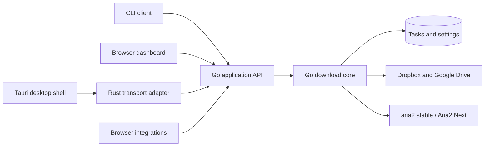

# TrueDown core, CLI, and desktop architecture

Reviewed: 2026-09-08. This document distinguishes the implemented foundation from
the proposed Tauri migration. Tauri has not been added to this repository.

## Direction

Retain the Go download core and expose it through one versioned application API.
CLI commands, the browser dashboard, and a future Tauri application become clients
of that core. aria2 stable and Aria2 Next remain engine adapters owned by Go.
Neither the CLI nor the WebView should operate aria2 or the task database directly.

Tauri embeds an [OS WebView](https://v2.tauri.app/reference/webview-versions/).
It still executes the same frontend rendering code,
so migrating the window alone will not remove table rebuilds or slow settings
dependencies. The current frontend work addresses those problems first.

## Available now

The existing executable accepts three launch modes. These are launch commands,
not a complete task-management CLI, and they currently use one executable.

| Command | Behavior |
| --- | --- |
| `TrueDown ui` | Default mode. Starts the service and opens its browser UI. A second launch opens the existing instance. Windows also has a tray. |
| `TrueDown serve` | Foreground Go HTTP service. No tray and no automatic browser. Stop through Ctrl+C/SIGTERM or the authenticated exit endpoint. |
| `TrueDown background` | No automatic browser; Windows retains its tray. On Unix this remains foreground and can be supervised by a user service. |
| `TrueDown serve --data-dir PATH` | Use an explicit data directory, ahead of the environment default. |

Packaged Windows binaries retain the GUI subsystem. When invoked with `serve`,
`--help`, or `--version`, they attach to an available parent console and preserve
redirected standard handles. PowerShell scripts that need to wait for the GUI
executable should use `Start-Process -Wait` with redirected output.

All modes use the same per-directory instance lock, database, authenticated HTTP
boundary, queue, and recovery implementation. The default endpoint remains
`http://127.0.0.1:15151`; distinct simultaneous profiles also need distinct configured
listener addresses. Closing the browser does not stop downloads.

Windows startup is opt-in through `GET/POST /settings/startup`. A [current-user Run
entry](https://learn.microsoft.com/en-us/windows/win32/setupapi/run-and-runonce-registry-keys)
launches the resolved executable in `background` mode with its data directory.
The OS registration is authoritative. It does not need administrator privileges,
copy credentials into arguments, or register a system service. Linux/macOS and
instances with process-scoped runtime/auth overrides use external service launchers.
Moving the executable requires disabling its old registration before re-enabling
it at the new location. Windows may also disable startup through its system UI.

The frontend now separates transport (`web/api.js`), navigation (`workspace.js`),
task-row reconciliation (`task-view.js`), settings (`settings.js`), logs (`logs.js`),
and task orchestration (`app.js`). It keeps native form controls and the canonical
shared component runtime. Settings and logs have direct hash URLs; changing views
does not recreate the service or its tasks.

## Remaining work before a Tauri release

### 1. Extract reusable service composition

Move listener setup, lifecycle cancellation, engine recovery, and application
services out of `main.go` into an `internal/app` package with explicit options.
Keep separate entrypoints such as `cmd/truedow-core` and `cmd/truedown` small.
Expose service readiness and a protocol/version handshake. A port answering HTTP
is insufficient proof that it is the expected TrueDown instance.

Build a CLI client for status, add, list, pause, resume, retry, and exit using the
same bounded API. Define exit codes and a machine-readable `--json` format.
Resolve credentials from the existing protected configuration or an explicit
environment input; avoid secrets in command-line arguments or logs. Never open
SQLite from a CLI client while the service owns it.

### 2. Make preferences portable between clients

Runtime concurrency, global speed, resolver rules, modules, authentication, and
updates already live on the server. Several new-task defaults still live in browser
localStorage: folder, connection count, per-task speed, headers, proxy, and extra
arguments. Move these into a bounded server settings API with the existing
`safefile` boundary before promising identical CLI, browser, and Tauri behavior.
Migrate legacy defaults explicitly, including the different WebView storage origin.

Preserve existing Windows portable data directories. If an installer switches to
a user data directory, provide a validated, recoverable migration of tasks,
configuration, tokens, engine state, and updater metadata. Never silently start an
empty profile because the installation directory changed.

### 3. Establish process ownership

The core owns aria2 children, database access, queue recovery, and its instance lock.
The Tauri shell owns windows, tray menus, notifications, and login startup. Disable
the Go tray when launched by Tauri. Keep the core instance lock even when the shell
uses Tauri's [single-instance plugin](https://v2.tauri.app/plugin/single-instance/).

Record whether the shell launched the core or attached to an existing service.
Closing a window should hide it while downloads continue. An explicit application
exit should request bounded graceful shutdown of a shell-owned core; an externally
supervised core should be disconnected from rather than accidentally terminated.
Specify crash recovery and orphan cleanup, including ownership of aria2 children.

Tauri supports packaging arbitrary executables as
[sidecars](https://v2.tauri.app/develop/sidecar/). Produce the Go sidecar for every
supported target architecture with Tauri's required target suffix. Prototype both
service attachment and a shell-owned sidecar before committing to release packaging.

### 4. Adapt transport and platform features

Prefer bundled frontend assets and narrowly scoped Rust commands that call the
authenticated Go API. The WebView should not receive arbitrary process execution,
filesystem access, or a reusable backend token. Preserve browser integrations on
the loopback HTTP listener. Introduce typed request/response contracts and a
transport adapter so browser fetch and native invoke share frontend behavior.

If a prototype loads the existing loopback dashboard directly, treat it as remote
content: it must not acquire broad native capabilities. A bundled-asset WebView has
a different origin; do not simply disable Go's host/origin checks or add wildcard
CORS. Review [Tauri capabilities](https://v2.tauri.app/security/capabilities/), CSP,
navigation restrictions, allowed external links, and credential exchange together.

Move folder/file opening, clipboard, notifications, and the tray behind platform
adapters. Migrate the existing Windows startup entry to one shell-owned registration;
Tauri's [autostart plugin](https://v2.tauri.app/plugin/autostart/) supports desktop
startup. Do not leave both the Go and Tauri launchers registered.

### 5. Replace the release/update transaction as a unit

The current self-updater stages and swaps only `TrueDown.exe`. It cannot update a
Tauri shell plus Go sidecar safely. Introduce an explicit compatibility version and
an update owner before shipping two binaries. Preserve the old launcher's health
check and rollback guarantees across the entire bundle. aria2/NEXT selection and
installation remain independent operations owned by Go.

Tauri's [updater](https://v2.tauri.app/plugin/updater/) requires signed update artifacts.
Add key management, CI signing, platform artifacts, and update metadata; the current
SHA-256 release manifest is not a substitute for a Tauri updater signature. Windows
code signing and macOS signing/notarization are additional release requirements.
Review WebView2 deployment and Linux WebKitGTK dependencies for the actual targets.

### 6. Verify the behavior across clients

- CLI-created tasks appear in both UIs, and all clients see the same preferences.
- Restart, engine switching, paused-task recovery, and torrent parent/child rebinding
  retain the existing guarantees under concurrent client requests.
- A second launch opens one UI, while closing it preserves ongoing downloads.
- Login startup, intentional exit, shell/core crashes, sidecar startup failure,
  and update rollback leave no duplicate engine or locked profile.
- Test task rendering, keyboard focus, wheel scrolling, dialogs, dark/light themes,
  and reduced motion in WebView2, WKWebView, and WebKitGTK. Keep browser coverage.
- Benchmark the same 100-row task page and a large server-side task database before
  and after the shell change. Do not attribute backend or DOM costs to window size.

## Suggested sequence

1. Land the current frontend and launch-mode changes, with browser/Go regressions.
2. Extract service composition, migrate task defaults, and build the CLI client.
3. Build a Windows Tauri prototype with one Go core, typed transport, and one tray.
4. Validate lifecycle and update rollback, then extend native packaging to Unix.

A Rust rewrite of the downloader is a separate project. It is unnecessary for this
migration and would duplicate mature resolver, persistence, and recovery work.

## Validation of this change

Node and Go regression suites, `go vet`, component synchronization, extension and
Windows builds, and Linux/WSL tests and service smoke checks passed. A packaged
Windows `serve` process completed a real local HTTP download, accepted a second
launch without another manager, and stopped through the exit API. Startup state
and failure handling were tested with isolated registration fixtures; a real
Windows logout/login cycle was not performed.

Browser checks covered desktop/mobile layouts, light/dark themes, reduced motion,
actual wheel scrolling, focus restoration, preserved category drafts, failed saves,
and stopping task polling on the logs route. In a local Chromium benchmark with
100 rows changing progress on every refresh (30 measured iterations after warmup),
the median render plus layout time changed from 54 ms for the original full-table
replacement to 5.2 ms for row reconciliation. This synthetic result measures the
rendering path, not end-to-end download throughput or every machine's UI latency.
