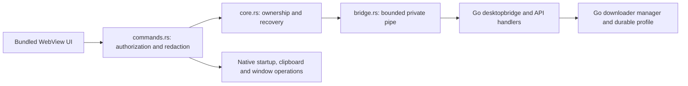

# TrueDown Tauri audit - 2026-09-08

Scope: the native shell, private Go bridge, profile/startup/update boundaries,
window roles, shared frontend lifecycle, task/settings state and UI consistency.
The audit started from a clean working tree. Product version: 1.6.3.

## Architecture after refactoring

`main.rs` composes the application and owns the event loop. `commands.rs` owns
native API dispatch and credential handling. `windows.rs` owns singleton roles,
their explicit permissions and minimum sizes. `web/task-forms.js` owns native
form initialization, coherent preference refresh and completion notifications;
`app.js` retains task submission and orchestration. The canonical component
runtime and generated icon resources remain shared across products.

## Findings and repairs

| ID | Severity | Reproduction / impact | Repair and verification |
| --- | --- | --- | --- |
| A01 | P2 | Main allowed every protocol operation; settings used a denylist, granting newly added routes implicitly. | Explicit GET/POST/DELETE allowlists for the four live roles; direct credential reads denied. Rust role tests and WebView2 permission rejection checks. |
| A02 | P2 | A control character in `/tasks?search=...` passed Rust validation but made Go reject the private protocol session. Case variants also allowed ambiguous duplicate headers. | Reject ASCII controls before pipe admission; both implementations enforce two distinct permitted headers. Rust/Go tests and a native connection-survival check. |
| A03 | P2 | CLI profile resolution buffered all output before checking 64 KiB and had no deadline, allowing a stalled helper to block native startup. | Async bounded reads, a 15-second deadline, kill-on-drop and explicit failure cleanup; validate the state path too. Real subprocess overflow/failure/timeout tests. |
| A04 | P2 | Cancelling the directory-picker receiver dropped the lock while the OS dialog remained open. | Move an owned per-role lock into the native callback. Regression cancels the receiver and verifies the role remains locked until callback completion. |
| A05 | P2 | Native-local startup and exit requests first tried to connect to the core; recovery failure could prevent these local operations. | Dispatch local operations before connection; retain the last verified ownership separately. Other operations continue through the private bridge. |
| A06 | P3 | Stderr draining used a framed JSON reader and stopped on an oversized diagnostic line. | Drain to an async sink with constant retained memory, without parsing or exposing diagnostics. |
| A07 | P2 | Leaving a settings category before its read completed marked it ready without initializing its controls. Returning could display old values and later save them. | Track loaded and rendered categories separately; initialize once on return and preserve subsequent drafts. Deferred-response regression plus real-browser settings tests. |
| A08 | P2 | Stopping a log read invalidated its completion, leaving the refresh control busy. | Cancellation clears its busy state immediately; stale completions cannot clear a newer request. Overlapping-read regression. |
| A09 | P2 | Finishing a task settings save after switching tasks could clear the shared button's newer busy state. Reload could discard an in-flight draft. | Derive busy/disabled state from the currently displayed task; block reload while saving. Two-task overlapping-save regression and task-detail browser tests. |
| A10 | P2 | Event registration completing after page teardown leaked its native subscription; material listeners and pending results also outlived the page. | One lifecycle-aware subscription helper and teardown guards for material updates. Late-registration/result regression tests. |
| A11 | P2 | Native GETs lacked the frontend's HTTP read deadline, leaving screens blocked until the long core request timeout. | Apply a 15-second frontend GET deadline and normalize methods. Do not replay requests; an aborted frontend wait does not revoke an accepted core operation. Regression covers timeout, pre-cancellation and dispatch count. |
| A12 | P2 | Monitor fitting replaced the new-task window's 520x420 minimum with the main window's 620x480 minimum. | Creation and fitting consume one role-size function. Geometry regression and native window acceptance. |
| A13 | P3 | C1 control characters from a task filename survived frontend title normalization and were rejected by Rust. | Match the native control-character policy before sending titles. Title regression. |

The UI changes address shared state, accessibility and layout contracts. They do
not introduce a separate visual component system. Focus, draft retention,
responsive scrolling, reduced motion and light/dark surfaces were checked using
the existing browser acceptance fixtures and inspected screenshots.

## Dependency assessment

The npm lockfile audit returned zero advisories. The initial OSV query found
seven affected packages. The 2026-09-09 follow-up addresses all seven:

- `glib 0.18.5`: backported the mutable FFI output pointer fix from
  [upstream PR 1343](https://github.com/gtk-rs/gtk-rs-core/pull/1343), resolving
  the source defect in RUSTSEC-2024-0429 while retaining GTK3 compatibility.
  The original version is retained. Version-only scanners still report the
  advisory; the checked source and optimized Linux regression provide the
  repair evidence. GLib is not in the active Windows graph.
- `glib-macros` and `gtk3-macros`: migrated to `proc-macro-error3 3.1.1` with
  Syn 2 compatibility. Removed `proc-macro-error` and its helper. The superseded
  `proc-macro-error2` is also unmaintained and is not used.
- `urlpattern 0.3.0`: replaced `unic-ucd-ident` with `unicode-id-start 1.4.0`,
  removing all five UNIC packages. ID_Start/ID_Continue semantics, special
  URLPattern characters and origin/path boundaries have regression coverage.

The final OSV query includes all 515 packages, including inactive platforms and
the four local patches. It reports only the GLib version advisory and its alias,
whose source defect is patched. Raw results are generated under
`truedown/dist/audit/dependencies-20260909.json`. No advisories are globally
suppressed. The four original archives, complete source hashes and minimal
patches are recorded in `desktop/vendor/patches.json`; license generation fails
if source verification fails and includes the local packages and change hashes.
See `desktop/vendor/README.md` for upstream provenance and removal criteria.

Linux Tauri now compiles and passes native WebKitGTK acceptance in WSL/Xvfb,
including all four windows, live preferences, drafts, permissions, submission,
close-to-hide and Toast clearance. The Linux fixture's obsolete resolver-control
assertions now validate inherited application settings. macOS native compilation
and composition remain unverified on this host; browser platform fixtures do not
substitute for those checks. Windows acceptance keeps all owned windows hidden,
so geometry tests are not described as visual composition verification.

Toast placement was also corrected on 2026-09-09: it is horizontally centered,
16px below the native title strip or safe-area inset, with bounded dimensions
and wrapping for long diagnostics. The entrance animation retains the same
center and stays below the caption. Browser coverage includes Windows/macOS/Linux
layouts, 100%/200% scaling, light/dark, compact settings, task forms and mobile.

## Validation record

| Check | Result |
| --- | --- |
| `npm test` | 312 passed after the dependency and Toast follow-up |
| `cargo test --locked` | 21 unit tests plus the URLPattern dependency regression passed on Windows |
| Linux optimized dependency regressions | 2 passed with `cargo test --locked --release --test dependencies`, including GLib FFI string iteration |
| `cargo clippy --locked --all-targets -- -D warnings` | Passed |
| `go test ./...` and `go vet ./...` | Passed on Windows |
| WSL cross-built Go tests | All 11 packages passed, including real aria2 integration and the new protocol package |
| Linux core smoke | SQLite, tasks, single-instance handling, engine cleanup and dashboard exit passed |
| Linux Tauri / WebKitGTK | Built in isolated WSL checkout; native Xvfb acceptance passed for all four windows, Toast placement, preferences, drafts, permissions and submission |
| Python history migration / release archive validation | 13 / 27 passed |
| `npm run ui:check`, `npm run icons:check` | Passed; no stale generated resources |
| Browser settings acceptance | 1040/820/390 widths, light/dark, scrolling, keyboard reachability and draft/save feedback passed |
| Browser native forms acceptance | New/batch roles, light/dark, 200% DPI, file/directory selection, preference refresh and submission passed |
| Browser workspace / file groups / task details | Desktop/mobile, light/dark, focus-preserving polling, grouping, persisted settings and conflict handling passed |
| Windows WebView2 hidden acceptance | All four windows, permissions, invalid-request connection survival, drafts, task refresh, cache, auth, DPI/theme/fallbacks, core recovery, external exit and orphan cleanup passed |
| Windows release build | `truedown/dist/TrueDown-1.6.3-windows-amd64`, including GUI subsystem, icon and DPI resource verification |
| Windows ZIP validation | `TrueDown-1.6.3-windows-amd64.zip`; exact file set, amd64 executables and notices passed; adjacent SHA-256 file generated |
| Packaged Windows smoke | Matched shell/core/CLI identity, hidden startup and graceful exit passed |
| Packaged core task-settings smoke | Live speed changes, paused connection edits, private details, group filtering and restart persistence passed |
| Extension build / changelog selection / `git diff --check` | Passed |

The native acceptance fixture copied the current Cargo binary as `TrueDown.exe`
alongside matching generated sidecars. An initial attempt with the older
Tauri-renamed debug executable failed the intended build-identity check; the
corrected fixture and the independently built release package both passed.
The desktop README now explains why a plain Cargo build must not reuse an older
renamed executable. Generated browser captures are in `truedown/dist/audit/`;
native tests use temporary isolated profiles and close their owned processes.
